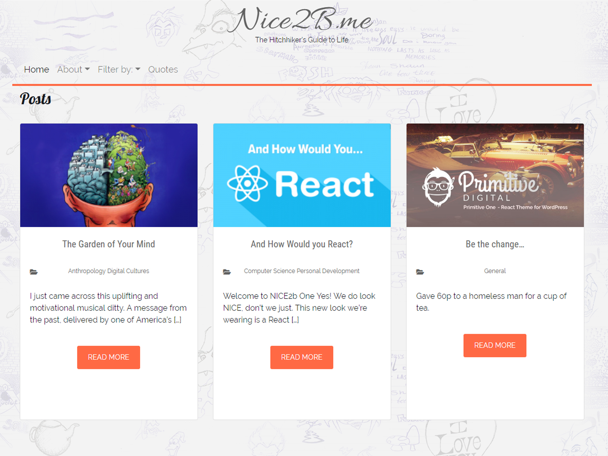

# Nice2b One Theme
A WordPress REST API based blog theme.
Theme Created with Node.js, using React 16, Bootstrap 4 and Webpack 4.

1st Release (April 01, 2019):
1. Beta version, supports posts and pages
2. Browser sync navigation withRouter additions

To Do
1. Optimise FontAwsome use
2. Integrate Google analytics

Setup
-----

The following pre-requisites should be in place for the theme to work:

1. WordPress version 5.0 or later
2. ACF Plugin Installed
2. Posts permalink set set to: Custom Structure - `/posts/%postname%/`
3. ACF Category permalink to be set as: Custom base - `/products/`

Installing and beginning development
------------------------------------

1. `git clone https://github.com/primitiveshaun/nice2bone`
2. `cd nice2bone`
3. `npm install`
4. `npm run build`
5. In the WordPress Admin Dashboard go to Appearances > Themes and Activate `Nice2B One`

The code is opensource so continue to play, develop or break the theme as you see fit.

Enjoy!

Support
-------

If you find any problems with this theme, please report an issue at:
(https://github.com/primitiveshaun/primitiveone/issues).

