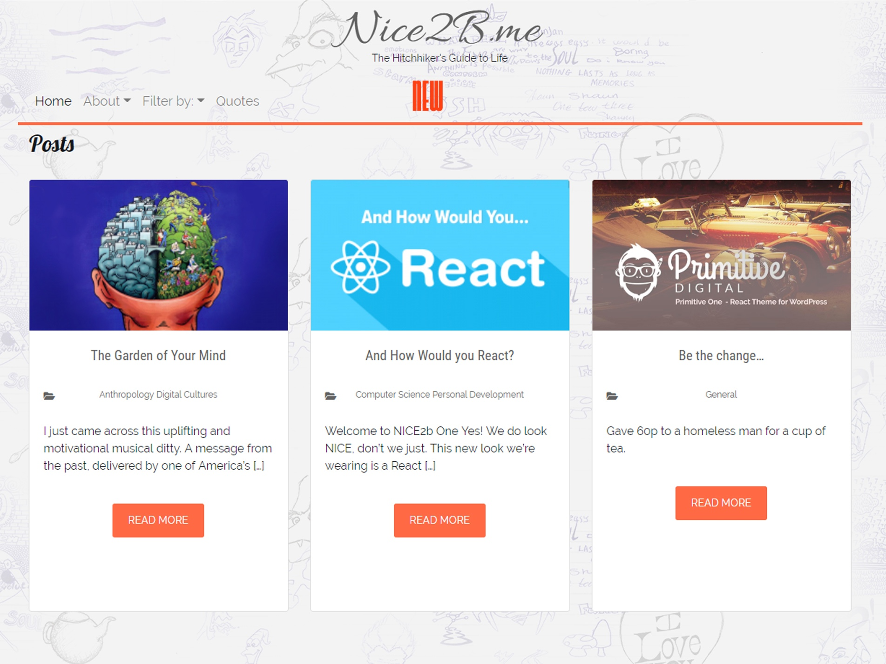

# Nice 2B One
A WordPress REST API based blog theme/app (CSR ONLY)

Crafted with Node.js, React 18, Bootstrap 4 and Webpack 5.

N.B. This was a very early experiment with React/WP.
Not suitable for Websites due to SEO or prod due to performance 

## Dev Notes

http://localhost:8888/n2b/tag/optimiseeverything/

# TO DO
1. Optimise Fonts use
2. Refine: titles / meta handling
3. Fix: 404 handling for CPT
4. Add: WP theme support and user configurables
5. moderise FA use - "@fortawesome/fontawesome-svg-core": "^6.4.0",

/wp/v2/menu-items

### Setup
-----

The following pre-requisites should be in place for the theme to work:

1. WordPress version 6.0 or later
2. Posts permalink set set to: Custom Structure - `/posts/%postname%/`

3. ACF and CPT Plugins Installed
4. WP REST Filter and WP REST Cache Plugins Installed

5. Create a CPT with permalink to be set as: Custom base i.e. - `/jokes/`

### Installing and beginning development
------------------------------------

1. `git clone https://github.com/primitive/nice2bone`
2. `cd nice2bone`
3. `npm install`
4. `npm run dev`

### Deployment
4. `npm run build`
5. In the WordPress Admin Dashboard go to Appearances > Themes and Activate `Nice2B One`

    "watch": "webpack --watch --mode=development",
    "start": "babel-node src/app.js",
    "serve": "nodemon --exec npm start"

### Refs
https://getbootstrap.com/docs/5.0/customize/css-variables/
https://fontawesome.com/v5/docs

### Inspiration
https://github.com/based-ghost/react-seo-friendly-spa-template

The code is opensource so go play...

Enjoy!

Tags

The Tags component is a React component that displays a list of posts that are associated with a particular tag. It does this by fetching the list of posts from a WordPress API endpoint that filters posts by the specified tag. The component also includes an infinite scrolling feature, which loads more posts as the user scrolls down the page. When the component is unmounted, it sets the getMorePostsWithTag method to null and removes the fade-in class from all elements with the card-outer class. The component also uses the ReactGA library to track page views.

Cat

This component is a React component that displays a list of posts in a given category. It fetches the posts from the WordPress Rest API, and uses the ScrollMagic library to implement infinite scrolling by calling the getMorePostsInCat method when the user scrolls to the bottom of the page. It also tracks pageviews with the Google Analytics library ReactGA. When the component is unmounted, the getMorePostsInCat method is set to null to prevent any errors. The component updates the page title to display the current category. It also applies a fade-in animation to each post using the ScrollMagic library when they enter the viewport.

This is a functional component in React that is used to display a list of posts in a particular category. It uses React hooks to manage its state, and also makes use of the fetch function to retrieve a list of posts from a WordPress site's REST API.

The component makes use of the useState hook to initialize state variables posts, category, page, getPostsInCat, and controller. It also uses the useEffect hook to perform side effects, such as setting up a ScrollMagic scene that allows the user to load more posts as they scroll to the bottom of the page.

The component has a getMorePostsInCat function that is used to retrieve more posts in the current category as the user scrolls down. It does this by making a fetch request to the WordPress REST API, passing in the current category and page number as parameters. If there are no more pages to retrieve, it sets the getPostsInCat state variable to false, which will prevent further requests from being made.

Finally, the component renders a loading icon while the list of posts is being retrieved, and then renders a PostList component with the retrieved posts when they are available.

### Release History

1.0.11
confirmed Functions.php is supported by classic and Block WordPress themes.
https://developer.wordpress.org/themes/basics/theme-functions/#:~:text=functions.php%20File-,Functions.,features%20to%20your%20WordPress%20theme.

1.0.10
Class to function conversion
Make work

1.0.9
Upgrade Webpack to v5
Maintenance
Class to function conversion
Some ChatGPT experiments

1.0.8
Add: tags support 

1.0.7
Add: ACF / Custom post type support
Add: ACF / Custom taxonomies support

# RC 1 (Jul 15, 2023):

# Stable Version (May 15, 2019):
1. Added: Google analytics
2. Added: title sync 
3. Added: 404 handling and preloaders for pages, posts and categories

# Beta version (April 01, 2019):
1. Supports posts, pages and categories

## Support
-------

If you find any problems with this theme, please report an issue at:
(https://github.com/primitive/nice2bone/issues).

